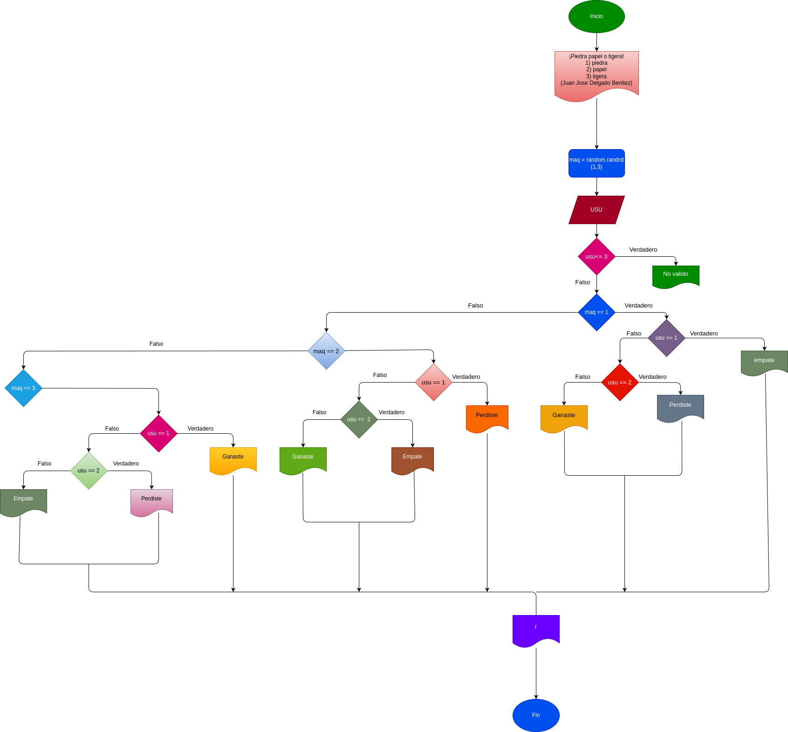

# Piedra_Papel_Tigera

# Analisis

## Input

### Variables de entrada 
usu: Eleccion realizada por el usuario

### prosessing

usu: Determina la decision del usuario.

Operaciones disponibles:

1) Piedra

2) Papel 

3) Tijera

Su usu no es valido, el resultado sera "No valido".

### output
usu: Determina la decision del usuario.

maq: Determina la decision de la maquina 
# Diseño

# Construccion